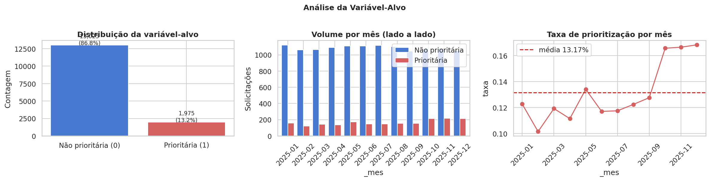
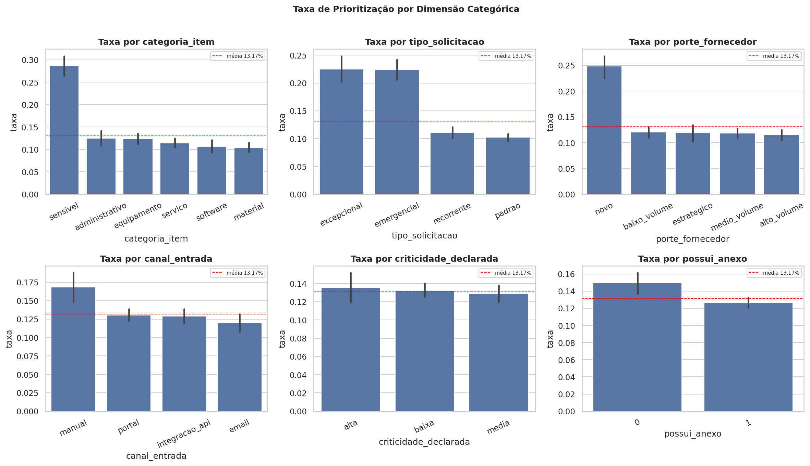
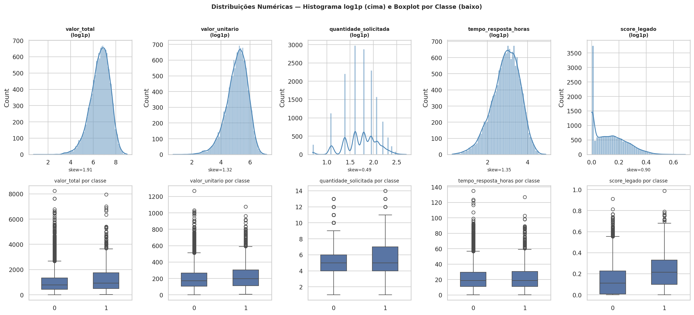
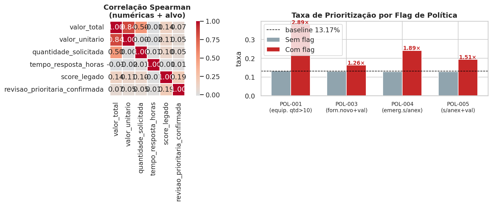
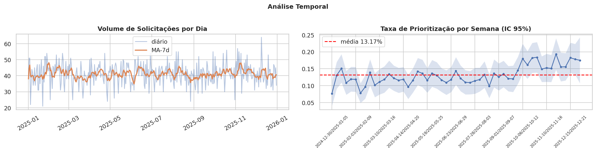
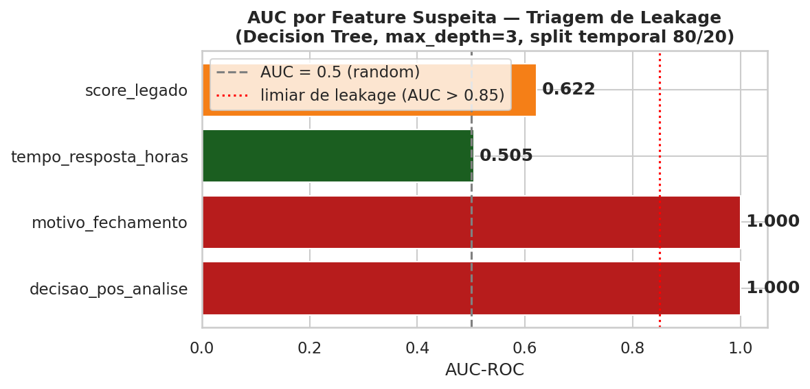

# EDA Findings — ACOL
**Caso:** Priorização Inteligente de Solicitações para Revisão Humana
**Notebook:** `notebooks/01_eda.ipynb`

---

### Achado 1 — Carga e Perfil Inicial

**Justificativa:** Antes de qualquer análise é necessário garantir integridade estrutural do dataset. A verificação por chave composta `(id_solicitacao, codigo_item)` detecta duplicatas que o `id_linha` único mascararia. A checagem aritmética de `valor_total` expõe erros de entrada de dados ou campos calculados inconsistentemente — ambos frequentes em sistemas ERP e portais de compras.

**Resultado:** **15.000 linhas × 21 colunas**, cobrindo o ano de 2025 (01/01 → 31/12). Dataset não possui valores nulos. Foram encontradas **69 duplicatas na chave (id_solicitacao, codigo_item)** que precisam de decisão antes da modelagem (manter, agregar ou remover). `valor_total` é perfeitamente consistente com `valor_unitario × quantidade_solicitada` (divergência 0%), e não há valores negativos. Dataset coerente com o briefing.

---

### Achado 2 — Variável-Alvo

**Método:** taxa global de positivos, barplot de volume por mês  + taxa mensal, `barplot` com intervalo de confiança 95% por cada dimensão categórica.

**Justificativa:** Conhecer o desbalanceamento define a métrica de avaliação correta — AUC-ROC ou Weighted F1 são mais adequados que acurácia em datasets desbalanceados. A análise temporal da taxa detecta *concept drift*: se o padrão de priorização muda ao longo do tempo, um split aleatório treinaria e avaliaria em distribuições diferentes, inflando métricas. O barplot com IC por dimensão identifica variáveis categóricas com poder discriminativo e orienta o feature engineering.

**Resultado:** Taxa global de priorização: **13,17%** (1.975 positivos vs 13.025 negativos — razão **7,6:1**). Taxa oscila entre 10,2% e 16,8% ao longo dos meses (std 2,3%), sem tendência clara de drift. Dimensões com maior poder discriminativo: **categoria `sensivel`** (28,7%), **porte `novo`** (24,8%), **tipo `excepcional`** (22,5%) e **`emergencial`** (22,4%). `criticidade_declarada` tem discriminação desprezível (alta=13,5%, media=12,9%, baixa=13,3%). Canal `manual` (16,8%) e ausência de anexo (14,9%) também se destacam.

---

### Achado 3 — Univariadas das Numéricas

**Método:** `describe()` + skew + kurtosis, histograma com KDE e  KDE com `log1p`, boxplot por classe do alvo, regra do Inter Quartil Range para outliers (fence = Q1 − 1,5·IQR / Q3 + 1,5·IQR).

**Justificativa:** Skewness > 1 indica assimetria forte que prejudica modelos sensíveis à escala (regressão logística, SVM, k-NN) e pode distorcer árvores ao criar splits muito desbalanceados. A comparação original vs `log1p` confirma empiricamente se a transformação comprime a cauda de forma útil. O boxplot por classe mede separação visual bruta — uma boa feature separa as caixas. A regra IQR é preferível ao z-score pois é robusta: o z-score é influenciado pelos próprios extremos que tenta detectar.

**Resultado:** `valor_total` (skew 1,91) e `valor_unitario` (skew 1,32) têm distribuição altamente assimétrica à direita → **transformação log1p recomendada**. `quantidade_solicitada` é bem comportada (skew 0,49, range 1–14). `score_legado` apresenta correlação Spearman mais alta com o alvo (0,187). `tempo_resposta_horas` não separa as classes visualmente. Outliers relevantes em `valor_total` (4,1%, p99 = R$ 3.947) e `tempo_resposta_horas` (2,9%, p99 = 70,2 h) — winsorização no p99 é adequada.

---

### Achado 4 — Bivariadas e Cruzamentos

**Método:** correlação de Spearman entre variáveis numéricas e  variável alvo, heatmaps de taxa de priorização para pares de variáveis categóricas, cálculo de *lift* (`taxa_com_flag / taxa_sem_flag`) para flags derivados das políticas documentais.

**Justificativa:** Correlação de Spearman é preferível a Pearson aqui pois captura relações monotônicas não-lineares e é robusta às distribuições assimétricas do Bloco 3. Os heatmaps de pares categóricos revelam interações que análises univariadas não capturam. O lift é a métrica natural para avaliar regras binárias derivadas de políticas: valor > 1 confirma que a regra documental tem sinal empírico e justifica investir na camada NLP.

**Resultado:** Todas as políticas têm **sinal empírico confirmado**. **POL-001** (equipamento, qtd > 10): lift **2,89×** (n=29, amostra pequena). **POL-004** (emergencial sem anexo): lift **1,89×** (n=493). **POL-005** (sem anexo, valor > p75 da categoria): lift **1,51×** (n=852). **POL-003** (fornecedor sem histórico, valor > média): lift **1,26×** (n=851). A camada NLP documental tem valor real.

---

### Achado 5 — Análise Temporal

**Método:** resample diário com média móvel 7 dias, taxa de priorização por semana com IC 95%, decomposição por dia da semana e mês, contagem de gap days.

**Justificativa:** A média móvel 7d suaviza ruído de fim de semana e revela tendências de médio prazo sem parâmetros arbitrários. A taxa semanal com IC95% distingue variação aleatória de mudança estrutural real. Gap days são críticos: períodos sem dados fazem o `TimeSeriesSplit` criar folds de tamanhos muito desiguais, comprometendo a validade da validação cruzada temporal.

**Resultado:** Série **contínua e sem gaps** — todos os 365 dias de 2025 têm pelo menos uma solicitação (~41/dia em média). Taxa semanal oscila entre 7,7% e 19,3% (std 2,7%), sem drift evidente, mas com variabilidade suficiente para justificar **`TimeSeriesSplit`**. Nenhuma janela degenerada identificada.

---

### Achado 6 — Join com `base_historica_fornecedores.csv`

**Método:** comparação de conjuntos de `fornecedor_id` entre datasets, scatter plot de `taxa_revisao_historica` vs taxa observada por fornecedor, correlação de Spearman entre as duas séries.

**Justificativa:** A cobertura do join determina quantos registros perderiam features de fornecedor em um merge inner — cobertura < 100% exigiria estratégia de cold-start. O scatter com correlação Spearman é o teste mais direto para detectar *data leakage* estático: se uma coluna calculada "externamente" é perfeitamente correlacionada com o target observado nos mesmos dados, ela foi calculada sobre o próprio conjunto de treino+teste.

**Resultado:** Cobertura **100%** — todos os 210 fornecedores têm registro. **Alerta crítico de leakage:** correlação Spearman entre `taxa_revisao_historica` e a taxa observada é **1,000** — calculada sobre os mesmos dados que estamos modelando. **Não pode ser usada diretamente como feature.** Decisão arquitetural: recalcular com *expanding window* por `data_solicitacao` no feature engineering.

---

### Achado 7 — Triagem Inicial de Leakage

**Método:** violinplot/barplot de cada feature suspeita contra o alvo, Decision Tree rasa (max_depth=3) treinada isoladamente em cada feature com split temporal 80/20, AUC-ROC como métrica.

**Justificativa:** O violinplot revela separação de distribuição — features com leakage crítico terão distribuições completamente distintas por classe. A Decision Tree rasa captura relações não-lineares simples que uma regressão logística poderia perder. AUC-ROC é preferível à acurácia em datasets desbalanceados: uma feature individual com AUC > 0,85 em split temporal é quase certamente leakage. O split temporal é obrigatório — split aleatório inflaria artificialmente o AUC de features com correlação temporal ao target.

**Resultado:** **Leakage crítico confirmado:** `decisao_pos_analise` e `motivo_fechamento` atingem **AUC = 1,000** — exclusão obrigatória. `score_legado` tem AUC = 0,622 — sinal útil, origem obscura, manter com cautela. `tempo_resposta_horas` tem AUC = 0,505 — sem poder preditivo isolado; avaliar disponibilidade no momento da solicitação.

---

### Achado 8 — Análise do Texto

**Método:** contagem de valores únicos e distribuição de tokens, barplot de top tokens por classe, pipeline TF-IDF (max 500 features, unigramas + bigramas) + Regressão Logística com split temporal.

**Justificativa:** Antes de investir em embeddings ou LLMs, é necessário verificar se o vocabulário é suficientemente rico. TF-IDF + LR é o baseline de NLP mais simples e interpretável — se não supera 0,60 de AUC, modelos mais complexos dificilmente compensarão o custo de treino e latência de inferência. O split temporal preserva a integridade da avaliação. Bigramas capturam expressões compostas como "serviço emergencial" que unigramas fragmentariam.

**Resultado:** `descricao_item` tem vocabulário **extremamente limitado**: apenas **18 descrições únicas** em 15.000 linhas (média de 2,3 tokens). TF-IDF + LR alcança **AUC = 0,567** — sinal marginal. **Decisão: não incluir feature textual dedicada** no modelo principal; `categoria_item` e `codigo_item` são representações suficientes.

---

## Bloco 9 — Síntese e Priorização

### Top 5 Achados Quantitativos
1. **Desbalanceamento 7,6:1** — 13,17% de priorização global; usar `class_weight='balanced'` ou oversampling.
2. **Categoria `sensivel` e porte `novo`** são as dimensões com maior taxa (28,7% e 24,8%), seguidas de tipo `excepcional`/`emergencial` (~22%).
3. **Flags de política têm lift real:** POL-001 = 2,89×, POL-004 = 1,89×, POL-005 = 1,51× — camada documental justificada empiricamente.
4. **`score_legado`** é a única numérica com correlação Spearman relevante (0,187); `valor_total` e `valor_unitario` exigem transformação log1p.
5. **`descricao_item` é quase constante** (18 valores únicos, AUC texto = 0,567) — não justifica feature textual.

### Top 5 Suspeitas de Leakage
| Feature | Risco | Justificativa |
|---|---|---|
| `decisao_pos_analise` | **Crítico** | AUC = 1,000 — resultado pós-decisão |
| `motivo_fechamento` | **Crítico** | AUC = 1,000 — preenchido após encerramento |
| `taxa_revisao_historica` | **Alto** | Correlação 1,000 com taxa observada — calculada sobre todo o histórico |
| `tempo_resposta_horas` | **Médio** | AUC = 0,505 — provável preenchimento pós-análise |
| `score_legado` | **Baixo** | Origem obscura; manter, mas monitorar |

### Top 10 Features Candidatas (por sinal observado)
1. `categoria_item` — maior separação categórica (sensivel: 28,7%)
2. `porte_fornecedor` — novo: 24,8%
3. `tipo_solicitacao` — excepcional/emergencial: ~22%
4. `flag_pol001` — lift 2,89× (equipamento, qtd > 10)
5. `flag_pol004` — lift 1,89× (emergencial sem anexo)
6. `flag_pol005` — lift 1,51× (sem anexo, valor alto)
7. `score_legado` — Spearman 0,187 com target
8. `flag_pol003` — lift 1,26× (fornecedor novo, valor acima da média)
9. `possui_anexo` — ausência eleva taxa (14,9% vs 12,6%)
10. `canal_entrada` — manual: 16,8%

### Riscos Abertos
- **69 duplicatas (id_solicitacao, codigo_item):** decidir tratamento antes de modelar.
- **`taxa_revisao_historica`:** recalcular com *expanding window* por `data_solicitacao`.
- **`score_legado`:** origem não documentada — risco de leakage latente.
- **POL-001** tem lift alto mas n=29 — amostra pequena, instabilidade esperada.

### Próxima Ação
Seguir para `notebooks/02_features.ipynb` priorizando as 10 features acima, tratando os leakages críticos como exclusões obrigatórias e recalculando `taxa_revisao_historica` com janela temporal.

*Fig. 1 — Distribuição do alvo, volume mensal e taxa de prioritização por mês.*

*Fig. 2 — Taxa de prioritização por dimensão categórica (IC 95%).*

*Fig. 3 — Distribuições numéricas (log1p) e separação por classe do alvo.*

*Fig. 4 — Correlação Spearman entre numéricas e alvo; lift das flags de política.*

*Fig. 5 — Volume diário com MA-7d e taxa semanal de prioritização (IC 95%).*

*Fig. 6 — AUC isolado por feature suspeita (Decision Tree, split temporal 80/20).*
